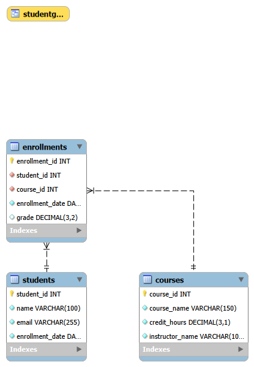

# Student Database CRUD System

## Overview
A multi-table relational database built in MySQL, managing students, courses,
and enrollments with full CRUD operations, a multi-table JOIN, a view, and a
stored procedure. Built as a SQL portfolio project to demonstrate schema
design and query judgment beyond basic syntax.

## ER Diagram

**Schema summary:**
- `Students` — student_id (PK), name, email (UNIQUE, NOT NULL), enrollment_date
- `Courses` — course_id (PK), course_name, credit_hours, instructor_name
- `Enrollments` — enrollment_id (PK), student_id (FK), course_id (FK),
  enrollment_date, grade (nullable — NULL represents an in-progress course)

**Cascade behavior:** Deleting a student cascades to delete their enrollment
records (`ON DELETE CASCADE`). Deleting a course with active enrollments is
restricted (`ON DELETE RESTRICT`) — enrollments must be removed first.

## How to Run
1. Open MySQL Workbench, connect to a local MySQL server (InnoDB support required).
2. Run `schema.sql` to create the database and tables.
3. Run `seed_data.sql` to populate sample data.
4. Run `crud_queries.sql` for CRUD examples and the transcript JOIN.
5. Run `views_and_procs.sql` to create the `StudentGPA` view and
   `EnrollStudent` procedure.
6. Test the procedure: `CALL EnrollStudent(<student_id>, <course_id>, '<date>');`

## What I Learned

Working through the JOIN types taught me that INNER JOIN vs LEFT JOIN isn't
just syntax — it's a decision about what "missing data" should mean. For the
GPA view, I used LEFT JOIN because I wanted every student from the Students
table to show up in the result, even if they had no enrollments yet — an
INNER JOIN would have silently dropped students like Zainab who haven't
enrolled in anything, which isn't correct behavior for a GPA report.

I also learned that UNIQUE constraints are a surprisingly powerful tool for
enforcing data integrity at the schema level rather than relying on
application code — and that NULL interacts with UNIQUE in a way I hadn't
expected: MySQL doesn't treat multiple NULLs as duplicates, so a UNIQUE
column can still end up with several NULL rows. That's part of why I made
email NOT NULL rather than leaving it nullable.

The stored procedure was the trickiest part. I was initially confused about
why the DELIMITER needed to change before defining the procedure, but I
learned that MySQL treats `;` as "end of statement" by default, so it has to
be temporarily swapped to something else (like `//`) to let the procedure
body contain multiple internal statements, then changed back afterward. I
also used SIGNAL SQLSTATE to raise a custom, clear error message when an
invalid student_id or course_id is passed in, instead of letting a generic
foreign key error surface.

Deciding the ON DELETE behavior for the two foreign keys in Enrollments also
took real thought. I set student_id to CASCADE, so deleting a student
automatically removes their enrollment records too. I set course_id to
RESTRICT instead, so a course with active enrollments can't be deleted
outright — it blocks the deletion and forces a deliberate cleanup first,
rather than silently wiping out enrollment history.